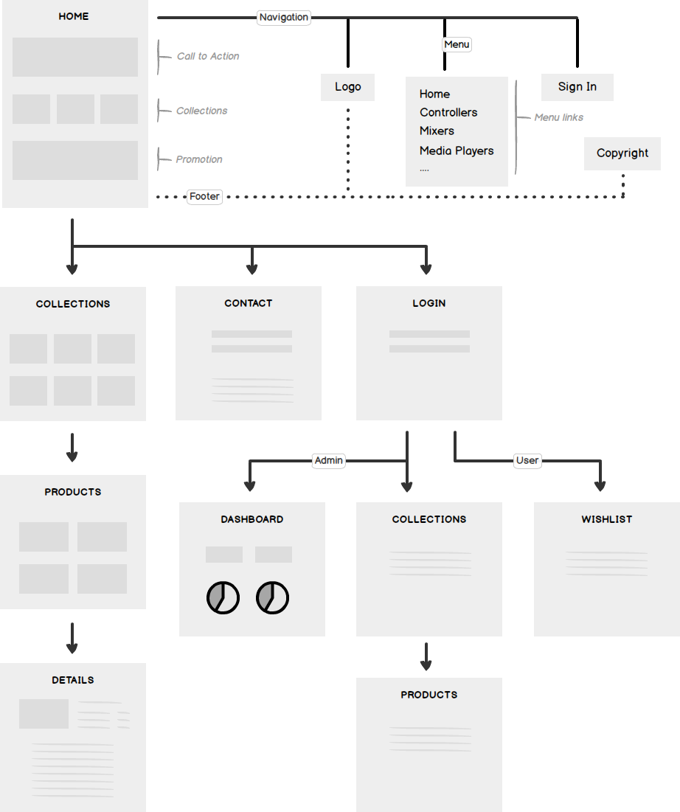
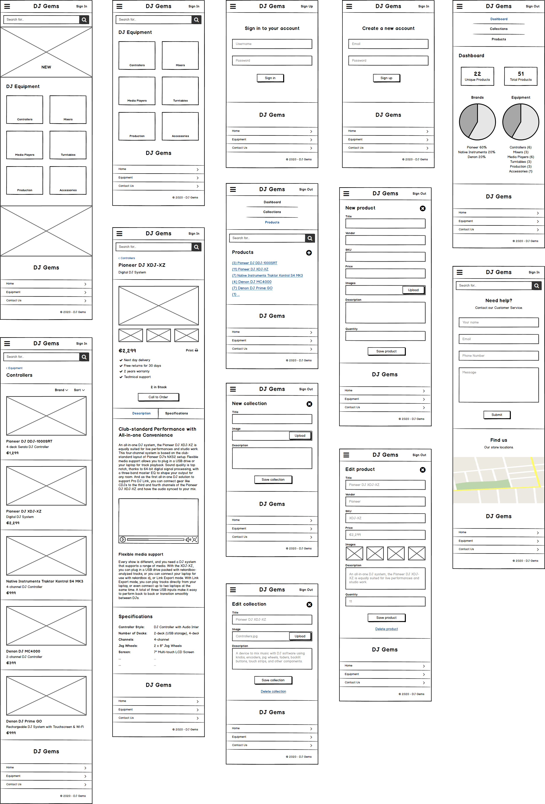

# Easy Inventory (Prototype)

A web-based inventory management application. Built with React, Python, Flask and MongoDB.

Please read the [Project Brief](ux/Project_Brief.md) document to learn more about the client and project requirements.

[Live Preview](https://invis.io/Y8VV7RQPVUF)


#### Table of Contents
- [Strategy](#strategy)
  - [Users](#users)
  - [User Needs](#user-needs)
  - [Business Goals](#business-goals)
- [Scope](#scope)
  - [Features](#features)
  - [User Stories](#user-stories)
- [Structure](#structure)
  - [Diagrams](#diagrams)
  - [Database](#database)
- [Skeleton](#skeleton)
  - [Interactive Prototype](#interactive-prototype)
  - [Wireframes](#wireframes)
- [Surface](#surface)
  - [Fonts](#fonts)
  - [Brand Colours](#brand-colours)
  - [Design Mockups](#design-mockups)
- [Tech](#tech)
- [Testing](#testing)
- [Deployment](#deployment)
- [Credits](#credits)

## Strategy

Inventory management and product promotion.

#### Users

*Customer*

- Professional DJs
- Beginner DJs

*Admin*

- Supplier

#### User Needs

*Customer*

* Read technical specifications
* View high resolution images
* Watch promotional videos
* Download product brochures
* Print product details
* Contact the supplier
* Order by phone
* Add to wishlist

*Admin*

* Login to admin area
* Import products
* Add technical specifications
* Upload high resolution images
* Upload promotional videos
* Edit product
* Remove product
* Export products

#### Business Goals

* Simple inventory management
* Product promotion
* Data storage
* Data analytics

## Scope

Manage the inventory and display product details to customers.

#### Features

* Product search
* Product filtering
* Product sorting
* Technical specifications table
* High-resolution images
* Promotional videos
* Call to order
* Print details
* Admin login
* CRUD (create, remove, updated and delete)
* Hosted database
* Statistics and charts

*Features to be implemented in the future:*

- Authentication
- Create an account
- Wishlist
- CSV import and export
- PDF brochure downloads

#### User Stories

Please read the [User Stories](ux/User_Stories.md) document to learn more about the features.

## Structure

Interaction design and information architecture.

#### Diagrams

*The Mind-map*



*Conceptual Data Model*


#### Database

*JSON*

```json
{
  "product": {
    "title": "Product Title",
    "body_html": "Product description...",
    "created_at": "1574982882",
    "published_at": "1574983268",
    "updated_at": "1574983277",
    "vendor": "Brand name",
    "id": 241311560,
    "sku": "sku2",
    "quantity": 7,
    "price": 995,
    "images": [
      {
        "id": 850703190,
        "product_id": 241311560,
        "position": 1,
        "created_at": "1574982882",
        "updated_at": "1574983277",
        "width": 110,
        "height": 140,
        "src": "http://"
      }
    ]
  }
}

```

## Skeleton

Low-fidelity wireframes and application prototype.

#### Interactive Prototype

[Live Preview](https://invis.io/Y8VV7RQPVUF)

#### Wireframes

For number reference to [User Stories](ux/User_Stories.md) please see the complete list of [Wireframe Mockups](ux/wireframes/Main.md).



## Surface

High-fidelity design mockups.

#### Fonts

...links

#### Brand Colours

...img

#### Design Mockups

*Home View*

*List View*

## Tech

- [Trello](https://trello.com/) - Kanban board
- [Cacoo](https://cacoo.com/) - Diagrams
- [Balsamiq Cloud](https://balsamiq.cloud/) - Wireframes
- [inVision](https://www.invisionapp.com/) - Prototypes

## Testing

...

## Deployment

...

## Credits

- [Sweetwater](https://www.sweetwater.com/) - DJ product specifications


