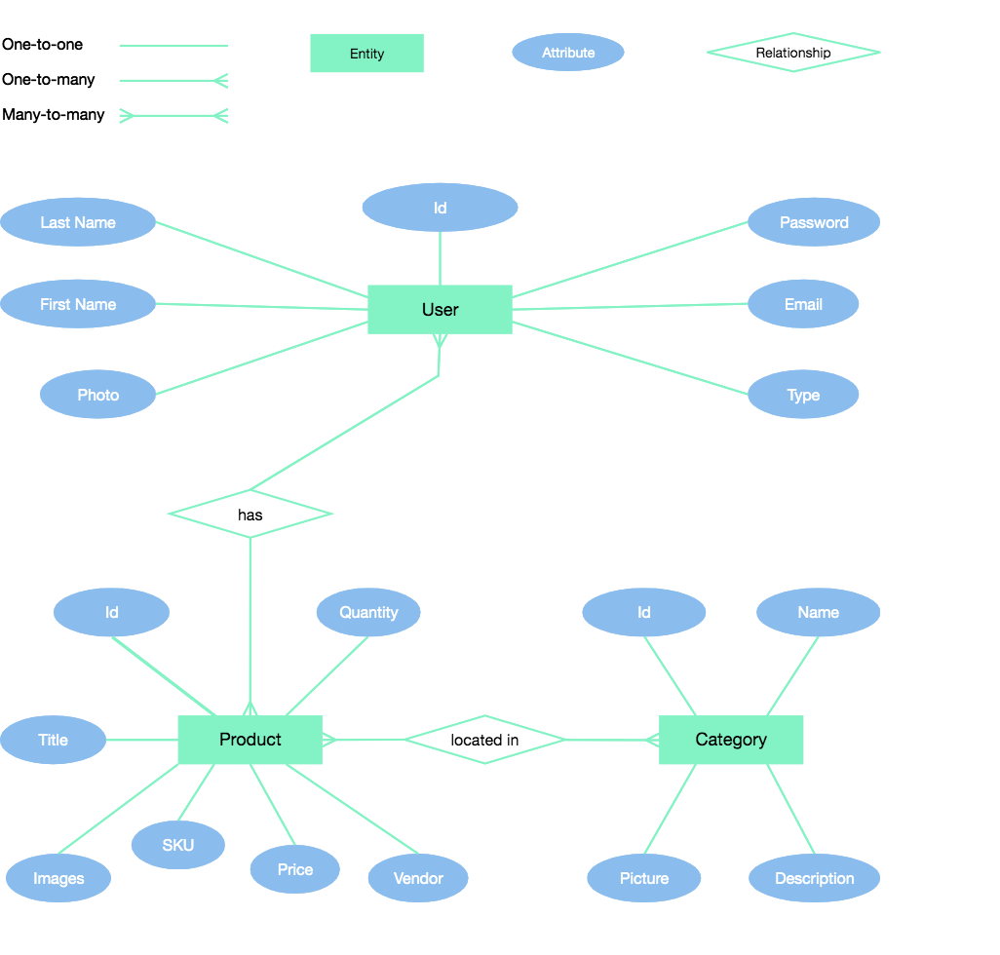

# Easy Inventory

A web-based inventory management application. Built with React, Python, Flask and MongoDB.

[Live Preview](https://#)

...img

## UX Design

Please read the [Project Brief](ux/Project_Brief.md) document to learn more about the client and project requirements.

### #1 Strategy

Inventory management and product promotion.

#### Users

- Store Owner / Supplier
- Professional DJs
- Beginner DJs

#### User Needs

* Read technical specifications
* View high reolution images
* Watch promotional videos
* Download product brochures
* Contact the supplier
* Print product details

#### Business Goals

* Simple inventory management
* Product promotion
* Data analytics

### #2 Scope

Manage the inventory and display product details to customers.

#### Features

* Product search
* PDF brochure downloads
* Products filtering
* Product sorting
* Technical specifications table
* High-resolution images
* Promotional videos
* Print details
* Admin login
* CRUD (create, remove, updated and delete)
* Hosted database
* Statistics and charts
* CSV import and export

Features to be implemented in the future:

- Authentication

#### User Stories

Please read the [User Stories](ux/User_Stories.md) document to learn more about the features.

### #3 Structure

Interaction design and information architecture.

**The Mind-map**

...img

**Conceptual data model diagram**



**JSON data**

```json
{
  "product": {
    "title": "Product Title",
    "body_html": "Product description...",
    "created_at": "1574982882",
    "published_at": "1574983268",
    "updated_at": "1574983277",
    "vendor": "Brand name",
    "id": 241311560,
    "tags": ["tag", "tag2", "tag3"],
    "variants": [
      {
        "option1": "Option 1",
        "price": "7.00",
        "sku": "sku1"
      },
      {
        "option1": "Option 2",
        "price": "9.00",
        "sku": "sku2"
      }
    ],
    "images": [
      {
        "id": 850703190,
        "product_id": 241311560,
        "position": 1,
        "created_at": "1574982882",
        "updated_at": "1574983277",
        "width": 110,
        "height": 140,
        "src": "http://"
      }
    ]
  }
}

```

### #4 Skeleton

Wireframes with referances to Epic user stories.

### Wireframes

**Home View**

...img

**List View**

...img

### #5 Surface

High fidelity design mockups.

#### Fonts

...link

#### Brand Colours

...img

#### Design Mockups

**Home View**

...img

**List View**

...img

## Tech

Diagrams made with https://cacoo.com/

## Testing

...

## Deployment

...

## Credits